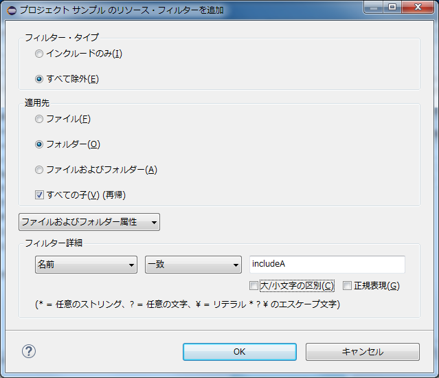

# プロジェクトからファイルを除外する(リソース・フィルター)

## 概要

プロジェクトに含めたくないファイル/フォルダがあるときは、リソース・フィルターで除外することができます。

## 操作方法

C++プロジェクトにおける事例とともに説明します。

### 事例

C++プロジェクトにおいて、複数の同名のヘッダファイルを別ディレクトリで管理している状況を考えます。  
このとき、片方のヘッダファイル(`includeB/LIBX.hpp`)にのみ存在する関数を参照すると、関数が見つからず警告が表示されてしまうことがあります。  
(このプロジェクトのビルドパス設定では`includeB`を設定しているためビルドは通るものとします)

以下の図では、Eclipseが関数`GetVal()`が存在しないほうのヘッダファイル(`includeA/LIBX.hpp`)を参照して警告(`Example.cpp`の6行目の赤線)を出力しています。  

ビルドに成功しているため、本来この警告は不要です。  
このような警告は、実際にビルドエラーとなる警告と紛らわしいため、表示されないようにしたいです。  

このプロジェクトでは`includeA`を使用しないため、以下の通り、ディレクトリをプロジェクトから除外することを考えます。

### リソースフィルターの設定
1. [プロジェクト]メニューより[プロパティー]を選択します。
2. [リソース]→[リソース・フィルター]を開き、[フィルターの追加]ボタンを押下します。  
  

3. [フィルター・タイプ]で「すべて除外」を選択します。
4. [適用先]で「フォルダー」を選択します。
5. [すべての子]にチェックを入れます。
6. [フィルター詳細]は「名前」、「一致」を選択し、フィルタ対象のフォルダ名を入力します。
   * ここでは除外する「`includeA`」を入力します。

7. [OK]を押します。  

8. [適用して閉じる]を押します。  

9. `includeA`フォルダがプロジェクトから除外され、警告(`Example.cpp`の6行目)が出なくなりました。  
