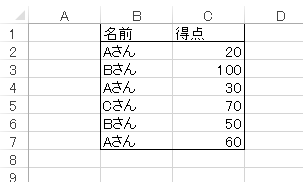
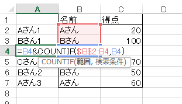
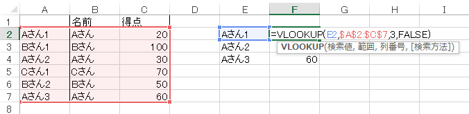
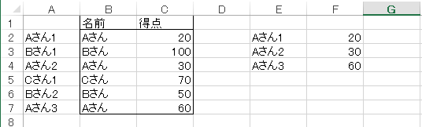

# COUNTIF関数
## 概要
COUNTIF関数では、指定したセル範囲内で条件に一致するセルの個数を取得します。

## 使用方法
`COUNTIF(範囲, 検索条件)`
* 範囲：数えたいセル範囲を設定します。
* 検索条件：数える条件として数値、式、セル範囲、または文字列で指定します。

## 使用例
COUNTIF関数の使用例として、繰り返し出現する項目の値を検索する方法を紹介します。
* 以下の点数表(B1:C7)で、プレーヤー毎にn回目のプレーの得点を取得したい場合を想定します。
* この表では「Aさん」が3回登場していますが、上から2つ目の得点をVLOOKUP関数で参照するには、「Aさん」では検索できません。

* そこで、COUNTIF関数を使用して、何番目の「Aさん」であるかをA列に表示することにします。
* A列に以下のような数式を入力します。
  * =B4&COUNTIF($B$2:B4, B4)

* すると名前の後ろに、出現回数に応じた番号が付きます。
* あとは、この出現回数付きの名前を使用してVLOOKUP関数で参照すれば、n回目に出現した値について検索することができます。

