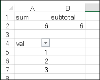
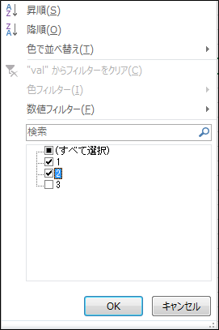
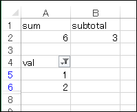

# SUBTOTAL関数
## 概要	
フィルタで絞り込んだ範囲だけでデータを集計したい場合はSUBTOTAL関数を使用します。

## 使用方法
SUBTOTAL関数の使用方法は次の通りです。 
`SUBTOTAL(<集計方法>, <セル範囲>)`  

集計方法は次の通り指定します。

| 値 | 集計方法 | 対応する関数 |
| -  | - | - |
| 1  | 平均値を求める | AVERAGE |
| 2  | 数値の個数を求める | COUNT |
| 3  | データの個数を求める | COUNTA |
| 4  | 最大値を求める | MAX |
| 5  | 最小値を求める | MIN |
| 6  | 積を求める | PRODUCT |
| 7  | 不偏標準偏差を求める | STDEV.S |
| 8  | 標本標準偏差を求める | STDEV.P |
| 9  | 合計値を求める | SUM |
| 10 | 不偏分散を求める | VAR.S |
| 11 | 標本分散を求める | VAR.P |

### 使用例
図のように、フィルタを設定したデータ列(`val`)があったとします。  
A2には「`=SUM(A5:A7)`」を設定しています。  
B2には「`=SUBTOTAL(9,A5:A7)`」を設定しています。  
最初はどちらも合計値6が表示されています。  

例えば、データ「1」、「2」のみを絞り込みます。  

すると、SUM関数では元の合計値6が表示されますが、SUBTOTAL関数ではフィルタ適用時の合計値3が表示されます。  

## 対応バージョン
Excel 2013で動作確認済みです。
