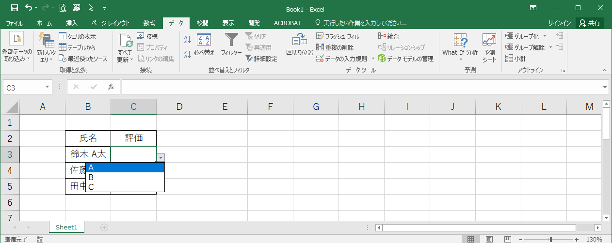

# ドロップダウンリストの設定
## 概要	
セルにドロップダウンリストを設定しておくと、設定されたリストの中から入力値を選べるので、簡単に入力操作ができ、入力ミスも防げます。

## 事例
ここでは、以下の表のセルC3:C5にドロップダウンリストの設定をします。  

## 操作方法
ドロップダウンリストの設定をするセル範囲(C3:C5)を選択し、[データ]タブの[データの入力規則]を選択します。  

[データの入力規則]ダイアログボックスが表示されるので、[設定]タブの[入力値の種類]の欄で[リスト]を選択し、 
[元の値]の欄に設定したい値を入力します。値は`,`(カンマ)で区切って入力します。 

対象のセルにドロップダウンリストが設定されます。  

## 対応バージョン
Excel 2013で動作確認済みです。
