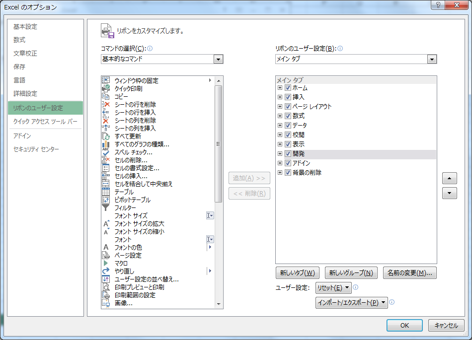
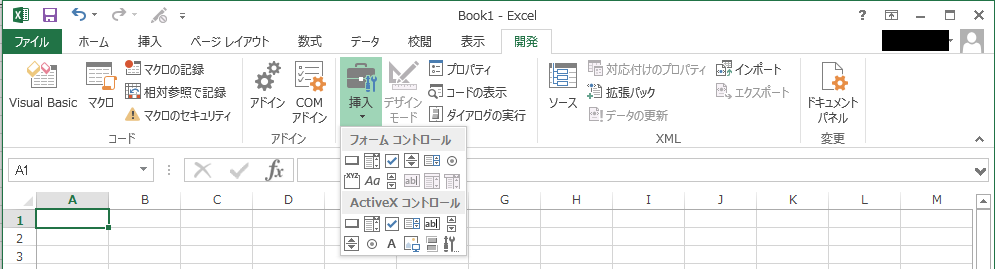
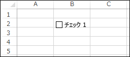
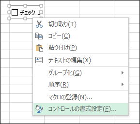
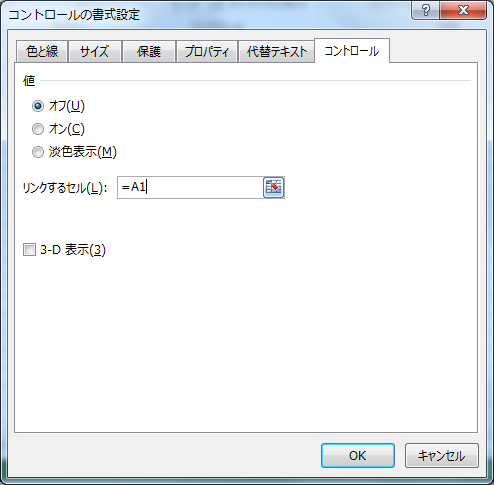
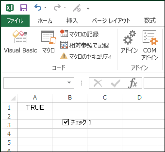
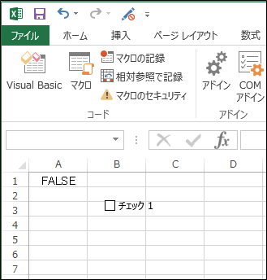

## 概要	
フォームコントロールを使用すると、クリックのみでセルの値を制御することができます。

## 操作方法	
ここではチェックボックスの利用方法を解説します。

1. [開発]タブの表示

   フォームコントロールを使用するためには、[開発]タブを表示する必要があります。  
   [開発]タブはデフォルトでは表示されていません。
   
   * [ファイル]タブ → [オプション] より[Excelのオプション]画面を開きます。
   * [リボンのユーザー設定]を選択し、右側の[開発]にチェックを入れます。

   

2. チェックボックスの作成

   * [開発]タブを表示し、[挿入]より[チェック ボックス（フォームコントロール）]を選択します。

   

   * 適当な場所をクリックするとチェックボックスが作成されます。

   

3. コントロールの追加

   * チェックボックスを右クリックし、[コントロールの書式設定]を選択します。

   

   * [コントロール]タブにて、[リンクするセル]を設定します。
      - ここでは「`=A1`」としています。

4. 動作確認

   
      
   * チェックボックスをクリックすると、リンクしたセルが「`TURE`」になります。

   
   
   * もう一度チェックボックスをクリックすると、リンクしたセルが「`FALSE`」になります。
   
   
   
   * 後はこのリンクしたセルを参照すれば、チェックボックスのクリック一つで他のセルを制御することができます。
   
