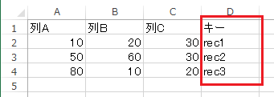
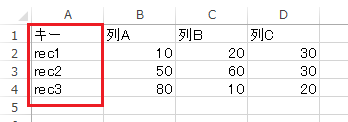

# 任意の列でVLOOKUPのような検索を行う

## 概要
INDEX関数とMATCH関数を組み合わせることにより、任意の列をキーにした検索が可能となります。

## 事例
以下の表のキー列を使ってレコードrec2の列Bの値を取り出したいとします。
このような場合、通常はVLOOKUP関数で検索しますが、VLOOKUP関数では、検索対象範囲の最も左の列をキーとして検索することしかできません。  

したがって、VLOOKUP関数を使うためには、以下のようにキー列を左に移動する必要があります。

表の形式が決まっていて、列を移動したくないこともあるかもしれません。

以下の方法を使用すると、任意の列で検索可能となります。

## 操作方法

* 検索結果を出力するセル(`B7`)に以下の式を入力します。
  * `=INDEX(対象範囲, MATCH(検索値, 検索範囲, 照合の型), 列番号)`
    * 対象範囲：取得したいデータを含むセル範囲を指定します
    * 検索値：検索するキーの値を指定します
    * 検索範囲：検索するキーを検索するセル範囲を指定します
    * 照合の型：`0`を指定すると検査値と等しい最初の値を検索します
    * 列番号：対象範囲の何列目のデータを取得するかを指定します

* 上記の例の場合、列番号2(列B)で検索値(キー)が「rec2」の行を指定しているので、  
「60」が返却されます。

* このように、VLOOKUP関数では不可能な検索方法を、INDEX関数とMATCH関数を組み合わせることで実現できます。

## 対応バージョン
Excel 2013で動作確認済みです。
