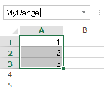
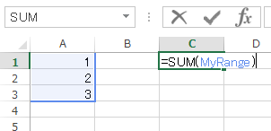
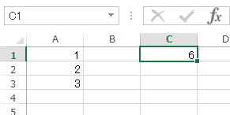

# 名前の定義(セル範囲)

## 概要
セル範囲の名前を定義すると、セル範囲を名前で参照することができます。

## 事例
数式でセル範囲を参照する際、「A1:A3」のようなセル範囲指定だと何のデータかわかりにくく、後で見たときに内容を理解するのに時間がかかります。

また、複数の場所から同じセル範囲を参照する際、毎回「A1:A3」のように指定するのはあまり効率的ではありません。

セル範囲に名前を付けると、データの内容が分かりやすくなり、セル範囲の参照も簡単になります。

## 操作方法
セル範囲を選択し、左上の[名前ボックス]に設定したい名前を入力して[Enter]キーを押します。
* ここでは「MyRange」という名前をつけました。

定義した名前を使用してみます。  
例えば、SUM関数に与えるセル範囲を「MyRange」と設定します。

名前を定義したセル範囲で合計値が計算されました。

このように、セル範囲に名前をつけると、通常の「A1:A3」のような指定よりも内容がわかりやすく、参照もしやすくなります。

## 対応バージョン
Excel 2013で動作確認済みです。
