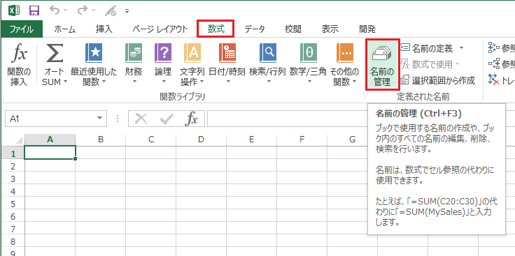
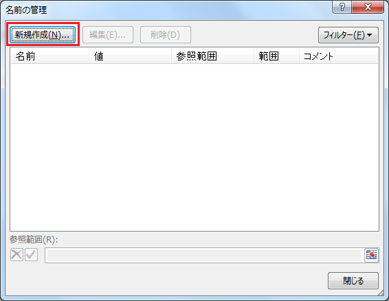
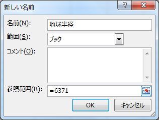
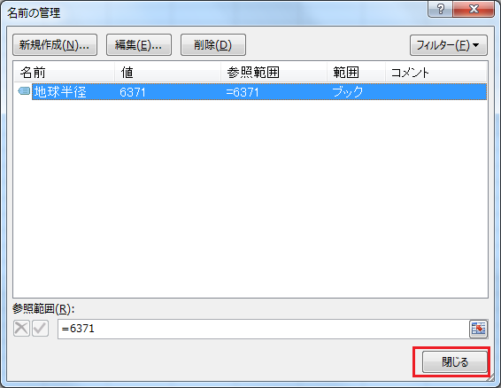
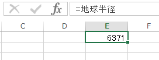

# 名前の定義(定数)

## 概要
定数に名前を定義すると、定数を名前で参照することができます。

## 事例
数式などで定数を扱いたいときは、通常、定数用のセルを設定しておき、それを絶対参照するという方法になると思います。

しかし、数式で参照する際「$B$3」のようなセル指定だと何のデータかよくわかりません。

また、定数のセルをうっかり上書きしてしまったりする可能性を考えると、定数をセルで管理することが、必ずしも最良の方法とは言えません。

定数に名前を定義すると、上記を解決することができます。

## 操作方法

[数式]タブより[名前の管理]を選択します。

[名前の管理]ダイアログが表示されたら、[新規作成]ボタンを押下します。

新しい名前を定義します。ここでは以下のように設定します。

|名前  |参照範囲   |
|-     |-          |
|地球半径|`=6371`|

入力したら[OK]を押します。

[閉じる]を押します。

定義した名前「地球半径」を以下のように参照すると、定義した値が表示されます。

このように、定数に名前を定義すると、数式で参照する際に、データの意味が分かりやすくなります。

## 対応バージョン
Excel 2013で動作確認済みです。
