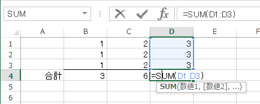
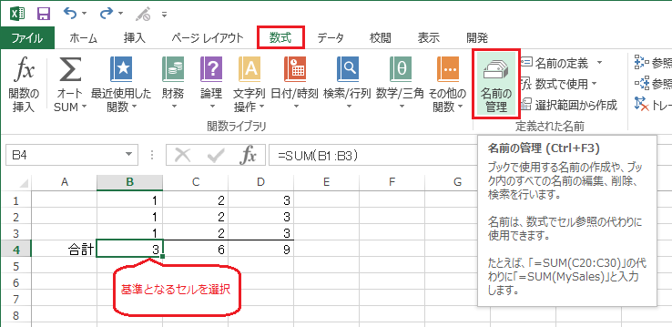
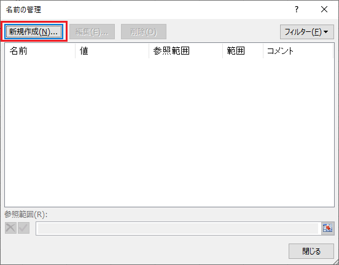
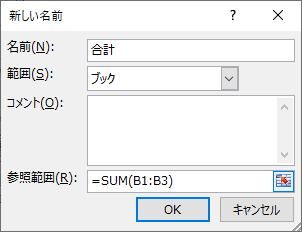
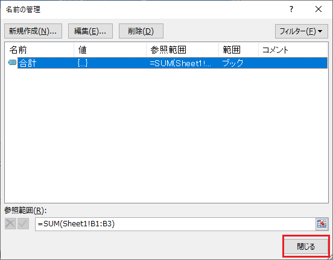
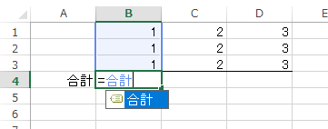
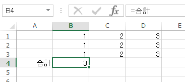
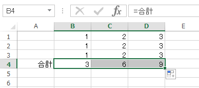
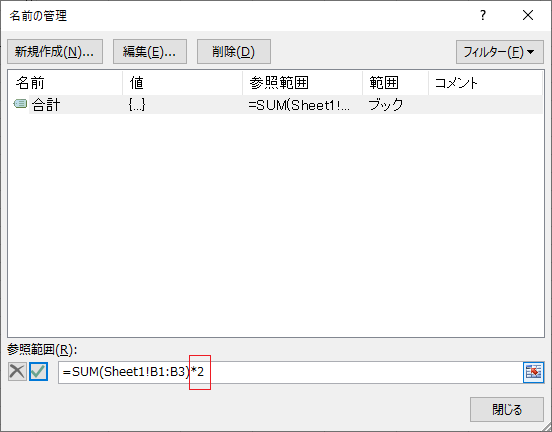
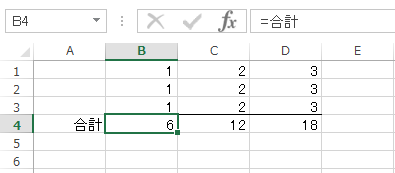

# 名前の定義(数式)
## 概要
数式の名前を定義すると、数式を名前で参照することができます。

## 事例
同じ数式を使用している複数のセルについて、数式を修正したいときは、1つのセルの数式を修正して、他のセルに数式をコピーすることになるかと思います。

しかし、コピーすべき範囲が膨大である場合は、効率的な方法ではありません。

数式に名前を定義すると、定義した数式を適用しているセルに数式の変更を一度に反映させることができます。

## 使用例
### 名前の定義
以下のような、合計値を求める数式に名前を定義してみましょう。  

合計値を出力するセル範囲の基準として、セル範囲で最も左のセル(ここでは「`B4`」)を選択します。  
[数式]タブより[名前の管理]を選択します。  

[名前の管理]ダイアログが表示されたら、[新規作成]ボタンを押下します。  

新しい名前を定義します。ここでは以下のように設定します。  
参照範囲に相対参照を設定するところがポイントです。

|名前  |参照範囲   |
|-     |-          |
|合計|`=SUM(B1:B3)`|

入力したら[OK]を押します。  

[閉じる]を押します。  

### 名前の使用
`B4`セルに定義した名前を入力します。  

`B4`セルに合計値が求まります。  

参照範囲を相対参照にしたため、同じ式を他のセルにも適用できます。  

#### 定義した数式の変更
定義した数式を変更すると、数式を使用する全てのセルに変更を反映することができます。  

ここでは、合計値を2倍にするとします。  
[名前の管理]ダイアログを開き、参照範囲を「`=SUM(セル範囲)*2`」に変更して[閉じる]を押します。  

以下のダイアログが出たら[はい]を選択します。  

合計値が2倍になりました。  

## 対応バージョン
Excel 2013で動作確認済みです。
