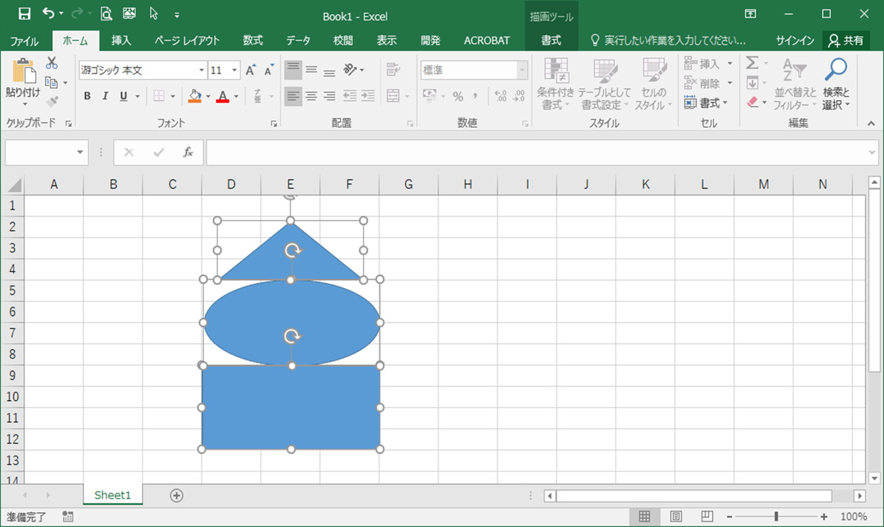
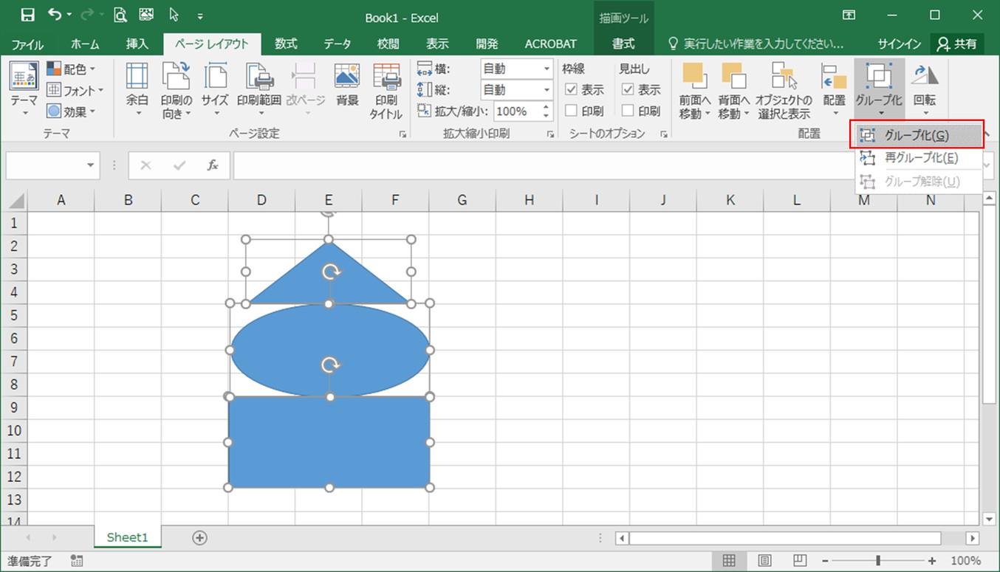
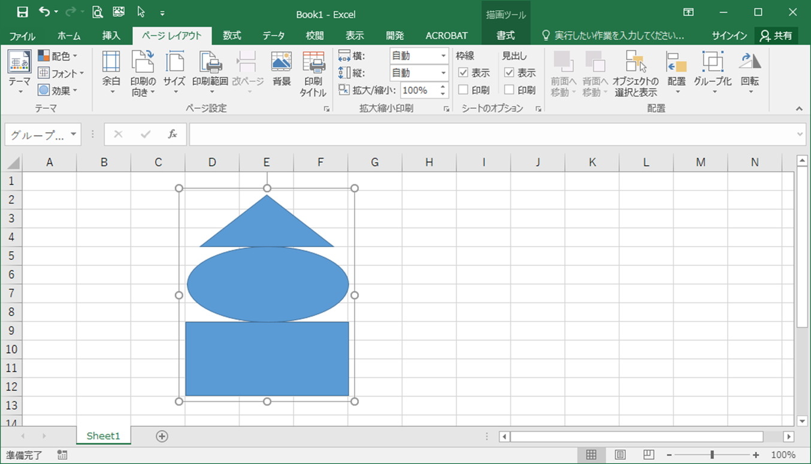
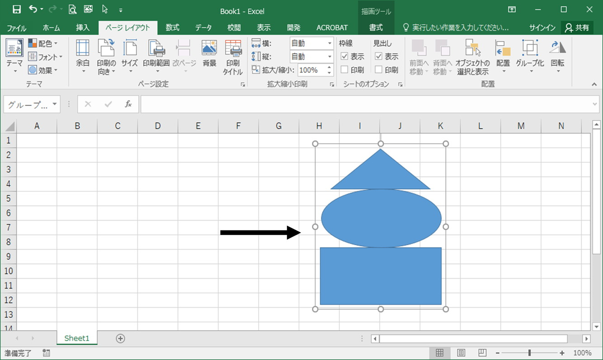
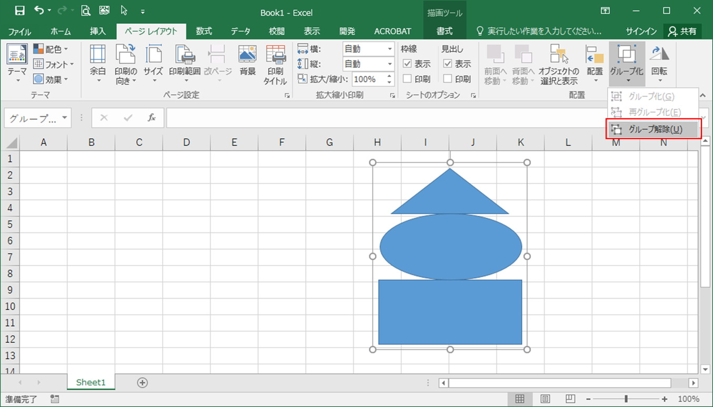
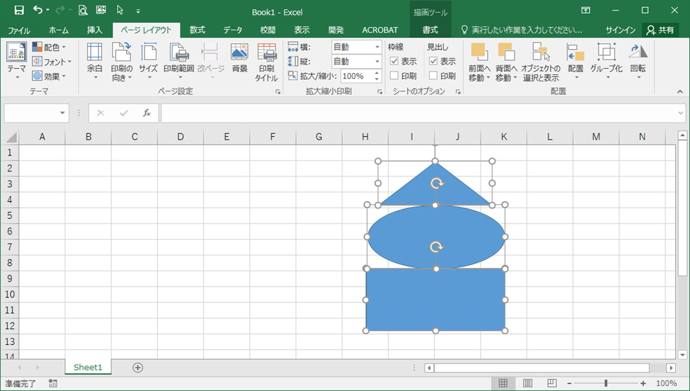

# 図形のグループ化

## 概要	
図形をグループ化すると、お互いの位置関係を変えずに、複数の図形を移動させることができます。

## 事例
以下の３つの図形を、お互いの位置関係を変えずに移動したいときは、[Ctrl]キーを押しながら対象の図形を一つずつクリックして選択して移動することになると思います。 

上の画像のように少数の図形を1回移動するだけならいいですが、多数の図形を何度も移動する必要がある場合は、とても時間がかかります。

このようなときは、図形をグループ化しましょう。

## 操作方法
グループ化したい図形を全て選択し、[ページレイアウト]タブの[グループ化]より[グループ化]を選択します。  

３つの図形がグループ化されます。  

グループ化した図形は、１つの図形として移動ができます。(位置関係が崩れません)  

クループ化を解除するときは、対象の図形を選択した状態で[ページレイアウト]タブの[グループ化]より[グループ化解除]を選択します。  

グループ化が解除されます。  

## 対応バージョン
Excel 2013で動作確認済みです。
