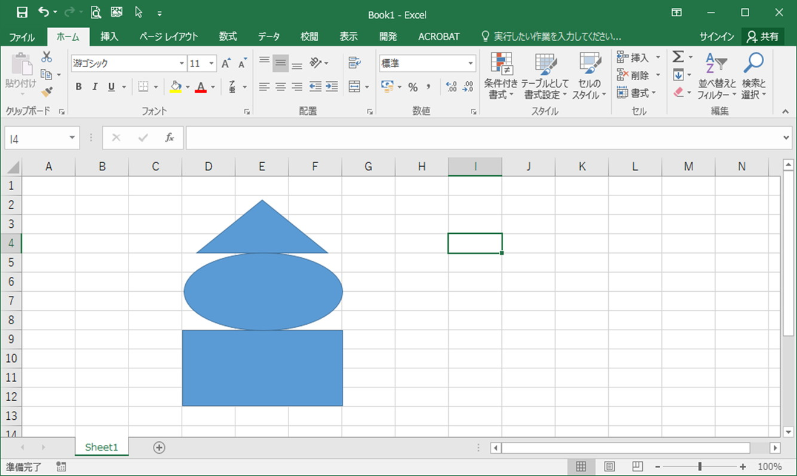

# 図形のグループ化

## 概要	
図形をグループ化すると、位置関係を変えずに、複数の図形を移動させることができます。

## 操作方法
ここでは、以下の３つの図形をグループ化します。  

[Ctrl]キーを押しながら対象の図形を左クリックし、グループ化したい図形を全て選択します。  

[ページレイアウト]タブの[グループ化]より[グループ化]を選択します。  

３つの図形がグループ化されます。  

グループ化した図形は、１つの図形として移動ができます。(位置関係が崩れません)  

クループ化を解除するときは、対象の図形を選択した状態で[ページレイアウト]タブの[グループ化]より[グループ化解除]を選択します。  

グループ化が解除されます。  

