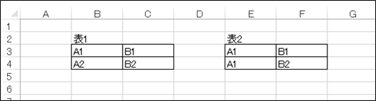
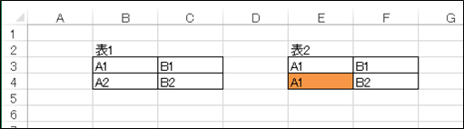
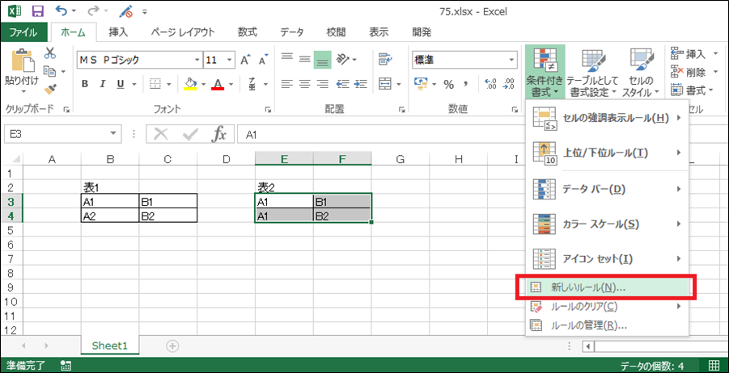
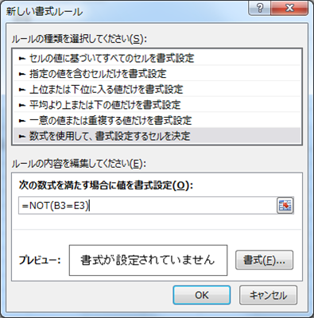
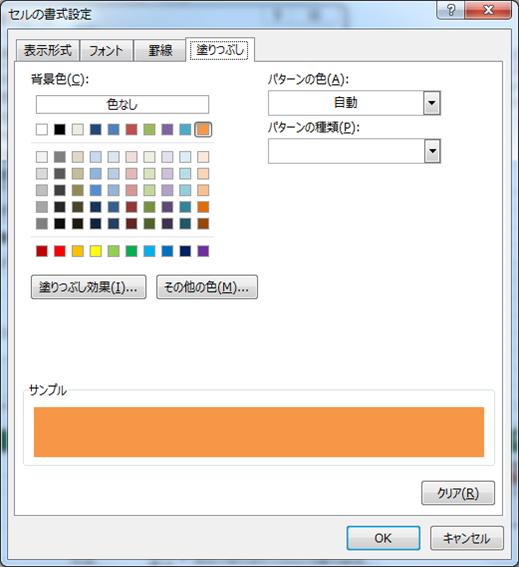

# 条件付き書式

## 概要	
条件付き書式を使用すると、セルの値に応じて指定の書式を適用することができます。

## 使用方法
ここでは、条件付き書式を利用したセル範囲の比較について事例とともに紹介します。

### 事例
以下のような2つの表を見比べたときに、どこに違いがあるのか、一目ではわかりません。 
違いのあるセルに色をつけて簡単に識別できたら便利です。   

理想 

### 解決方法
そんな時は条件付き書式が役に立ちます。  
条件付き書式の適用先として、表2の範囲を選択します。  
[ホーム]タブの[条件付き書式]より[新しいルール]を選択してください。  

[数式を使用して、書式設定するセルを決定]を選択します。  
[次の数式を満たす場合に値を書式設定]に以下の式を入力します。  
   * `=NOT(B3=E3)`
   * 比較するセル範囲の最も左上のセルを指定します。

[書式]ボタンをクリックします。  
今回は、差分のあるセルをオレンジ色に塗りつぶそうと思うので、[塗りつぶし]タブでオレンジ色を選択し、[OK]を押します。  

すると、表2の範囲で表1と差分のあるセル(E4)がオレンジ色になりました。  

差分があれば、別のセル(F3)でも色がつきます。  

## 対応バージョン
Excel 2013で動作確認済みです。
