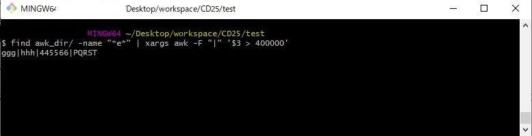

# パターンに合致した行を出力する

## 概要

`find`と`awk`を使用して複数ファイルのテキストを処理する方法を説明します。


## 操作方法

### コマンド

```console
$ find awk_dir/ -name "*e*" | xargs awk -F "|" '$3 > 400000'
```

### 実行例

#### 前提条件

`|`で区切られたデータを持つファイルが複数ある。
<!--  -->

```console
$ cat awk_dir/career.txt
aaa|bbb|112233|ABCDE
ccc|ddd|223344|FGHIJ
eee|fff|334455|KLMNO

$ cat awk_dir/design.txt
ccc|ddd|223344|FGHIJ
eee|fff|334455|KLMNO
ggg|hhh|445566|PQRSR

$ cat awk_dir/252525.txt
eee|fff|334455|KLMNO
ggg|hhh|445566|PQRST
uuu|jjj|556677|UVWXY
```

#### やりたいこと

任意の名前のファイルから3列目のデータが400000以上の行を抽出する。
<!--  -->

```bash
$ cat awk_dir/design.txt
ccc|ddd|223344|FGHIJ
eee|fff|334455|KLMNO
ggg|hhh|445566|PQRSR # <- これを抽出したい！
```

#### 実行例

1. 以下コマンドを実行します。
    ```console
    $ find awk_dir/ -name "*e*" | xargs awk -F "|" '$3 > 400000'
    ```

2. ファイル名に文字列"e"を含むdesign.txtから区切り文字"|"で区切られた3番目の数値が400000以上の行が表示されました。
<!--  -->
    ```console
    $ find awk_dir/ -name "*e*" | xargs awk -F "|" '$3 > 400000'
    ggg|hhh|445566|PQRSR
    ```

### 解説
1. `find`コマンドの書式は以下の通りです。
    ```sh
    find [検索先] [オプション] [ファイル名] ※[ ]は省略可能
    ```
2. 検索先に`awk_dir/`と設定することで、`awk_dir`ディレクトリ内からファイルを検索します。デフォルトはカレントディレクトリです。

3. オプション`-name`はファイル名を指定して検索する場合のオプションです。<br>

4. ファイル名`*e*`はワイルドカードを使用して、文字列`e`が含まれるファイルを検索します。
<!--  -->
    ```console
    $ find awk_dir/ -name "*e*"
    awk_dir/career.txt
    awk_dir/design.txt
    ```

5. この結果をパイプ`|`で`xargs`コマンドに渡しています。<br>
<!--  -->
    ```console
    $ find awk_dir/ -name "*e*" | xargs awk -F "|" '$3 > 400000'
    ```


6. `xargs`コマンドは入力された値を指定するコマンドの引数に設定して実行するコマンドで、書式は以下の通りです。ここでは、4.の結果(ファイル名のリスト)を`awk`コマンドの引数に渡しています。
    ```sh
    xargs [オプション] コマンド [コマンドの引数]　※[ ]は省略可能
    ```

7. awkコマンドはテキストファイルを1行ずつ読み、パターンに合致した行を出力するコマンドで、書式は以下の通りです。<br>
ここでは、4.の結果(ファイル名のリスト)をawkコマンドの引数に渡しています。
    ```sh
    awk [オプション] コマンド ファイル　※[ ]は省略可能
    ```
8. オプション`-F`は区切り文字`|`を指定する場合のオプションです。デフォルトは空白文字です。<br>

9. コマンド`'$3 > 400000'`は区切り文字`|`で区切られた3番目の数値が400000以上の行を出力します。


