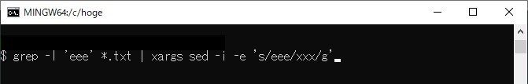
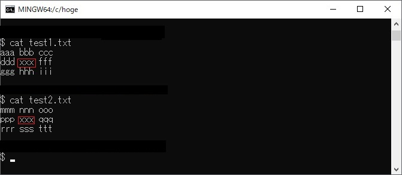
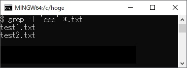

# 複数ファイルの文字列を置換する

## 概要

`grep`と`xargs`, `sed`コマンドを使用して複数ファイルの文字列置換をする方法を説明します。

## 操作方法

### コマンド
```console
$ grep -l '置換対象文字列' 置換対象ファイル | xargs sed -i -e 's/置換対象文字列/置換後文字列/g'
```

### 実行例
1. 以下の2つのファイルの文字列`eee`を`xxx`に置換します。
    ```bash
    $ cat test1.txt
    aaa bbb ccc
    ddd eee fff # -> ddd xxx fff
    ggg hhh iii

    $ cat test2.txt
    mmm nnn ooo
    ppp eee qqq # -> ppp xxx qqq
    rrr sss ttt
    ```

2. 以下のコマンドを実行します。
<!--  -->
    ```console
    $ grep -l 'eee' *.txt | xargs sed -i -e 's/eee/xxx/g'
    ```

3. 2つのファイルで文字列`eee`が`xxx`に置換されました。
<!--  -->
    ```console
    $ cat test1.txt
    aaa bbb ccc
    ddd xxx fff
    ggg hhh iii

    $ cat test2.txt
    mmm nnn ooo
    ppp xxx qqq
    rrr sss ttt
    ```

### 解説
1. grepコマンドは置換対象文字列の検索に使用します。書式は以下の通りです。
    ```sh
    grep [オプション] 検索パターン [ファイル名]　※[ ]は省略可能
    ```
2. 検索パターンに置換対象文字列、ファイル名に`*.txt`と設定することで、カレントディレクトリ内の全ての`.txt`のファイルについて置換対象文字列を検索します。

3. オプション`-l`は検索にヒットしたファイル名のみを表示するオプションです。`grep`コマンド単体で実行すると以下のようになります。<br>
    <!--  -->
    ```console
    $ grep -l 'eee' *.txt
    test1.txt
    test2.txt
    ```

4. この結果をパイプ`|`で`xargs`コマンドに渡しています。<br>
    <!--  -->
    ```console
    $ grep -l 'eee' *.txt | xargs sed -i -e 's/eee/xxx/g'
    ```

5. `xargs`コマンドは入力された値を指定するコマンドの引数に設定して実行するコマンドで、書式は以下の通りです。ここでは、3.の結果(ファイル名のリスト)を`sed`コマンドの引数に渡しています。
    ```sh
    xargs [オプション] コマンド [コマンドの引数]　※[ ]は省略可能
    ```

6. ここではsedコマンドを文字列の置換に使用しています。書式は以下の通りです。
    ```sh
    sed [オプション] スクリプトコマンド 入力ファイル　※[ ]は省略可能
    ```

7. スクリプトコマンドには入力ファイル内文字列の置換や削除を行うためのコマンドを記述します。スクリプトコマンドは`-e`オプションで指定できます。

8. ここでは置換を行うため、次の文法で記述しています。<br>
   `s`は置換を指定するコマンド、`g`はファイル全体を一括置換するオプションです。
    ```sh
    's/置換対象文字列/置換後文字列/g'
    ```

9. `sed`コマンドの`-i`オプションはファイルを上書きするオプションです。

## 対応バージョン
以下のバージョンで動作確認済です。

| コマンド | バージョン | 
| --- | ---|
| grep | 3.1 |
| xargs | 4.7.0 |
| sed | 4.8 |

