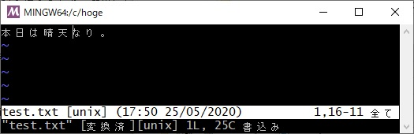

# ファイルの文字コードを変更する

## 概要
Vimでファイルの文字コードを変更します。

## 操作方法
ここでは、文字コードUTF-8のファイルを文字コードShift-JISに変更したいと思います。

### ファイルの文字コードを確認する
以下のコマンドを入力して確認します。
```sh
:set fenc?
```


このファイルの場合は、"utf-8"(UTF-8)となっています。<br>


### ファイルの文字コードを変更する
以下のコマンドを入力すると文字コードを変更できます("sjis"は文字コードShift-JISを意味します)。
```sh
:set fenc=<文字コード>
```


修正ありを示す"[+]"マークが表示されました。この状態ではまだファイルは保存されていません。<br>


### 保存する
以下のコマンドを入力してファイルを保存します。
```sh
:w
```


保存が完了しました。<br>


### 変更後のファイルの文字コードを確認する
以下のコマンドを入力して確認します。
```sh
:set fenc?
```


文字コードが"sjis"(Shift-JIS)となっています。<br>


### (付録) 変更後のファイルを表示する
以下のコマンドでファイルを開き直します。
```sh
:e
```


文字化けを起こしていますが、これはエディタの文字コード設定がShift-JISでないためです。<br>


#### エディタの文字コード設定を確認する
以下のコマンドでエディタの文字コード設定を確認できます。
```sh
:set enc?
```


現在の設定は"utf-8"(UTF-8)となっています。<br>ファイルとエディタで文字コードが異なると、文字化けを起こしてしまいます。<br>


#### エディタの文字コード設定を変更する
以下のコマンドでエディタの文字コード設定を変更します。
```sh
:edit ++enc=<文字コード>
```


エディタの文字コード設定がShift-JISに変更され、文字化けが解消しました。<br>


## 対応バージョン
バージョン8.2で動作確認済みです。
