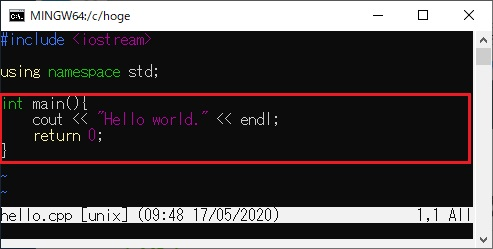
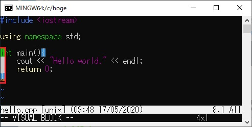
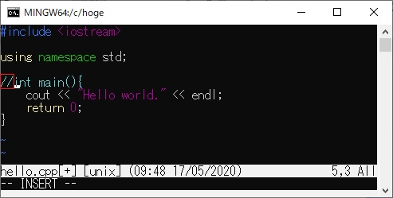
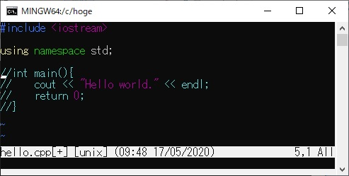
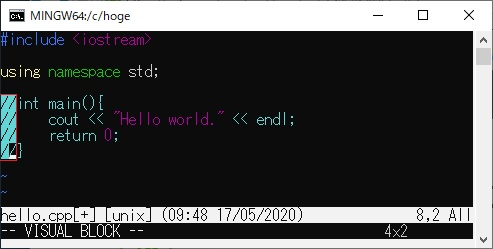
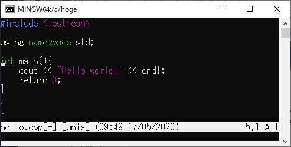

# 複数行をコメントアウトする

## 概要

Vimで複数行をコメントアウトする方法を説明します。

## 操作方法

### コメントアウトする
1. 図の赤枠の行をコメントアウトしたいとします。 
    

2. [Ctrl+v]で矩形選択モードにします。
3. カーソルを行頭に移動し、方向キーでコメントアウトしたい範囲を選択します。 
    

4. [Shift+i]を押下します。
5. コメント文字列(ここでは"//")を入力します。(このとき、先頭行のみに入力されます) 
    

6. [Esc]を押下すると、選択した行にコメントアウトが適用されます。 
    

### コメントアウトを解除する
1. [Ctrl+v]で矩形選択モードにします。
2. 方向キーで削除したいコメント箇所を選択します。 
    

3. [d]を押下すると、選択した範囲が削除され、コメントアウトが解除されます。 
    

## 対応バージョン
バージョン7.4で動作確認済です。
