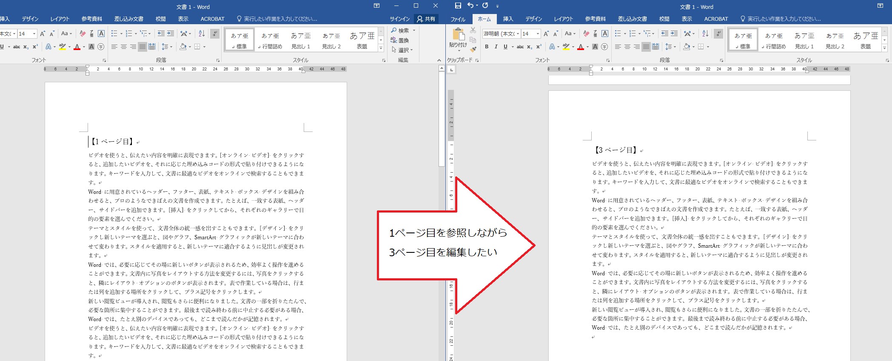
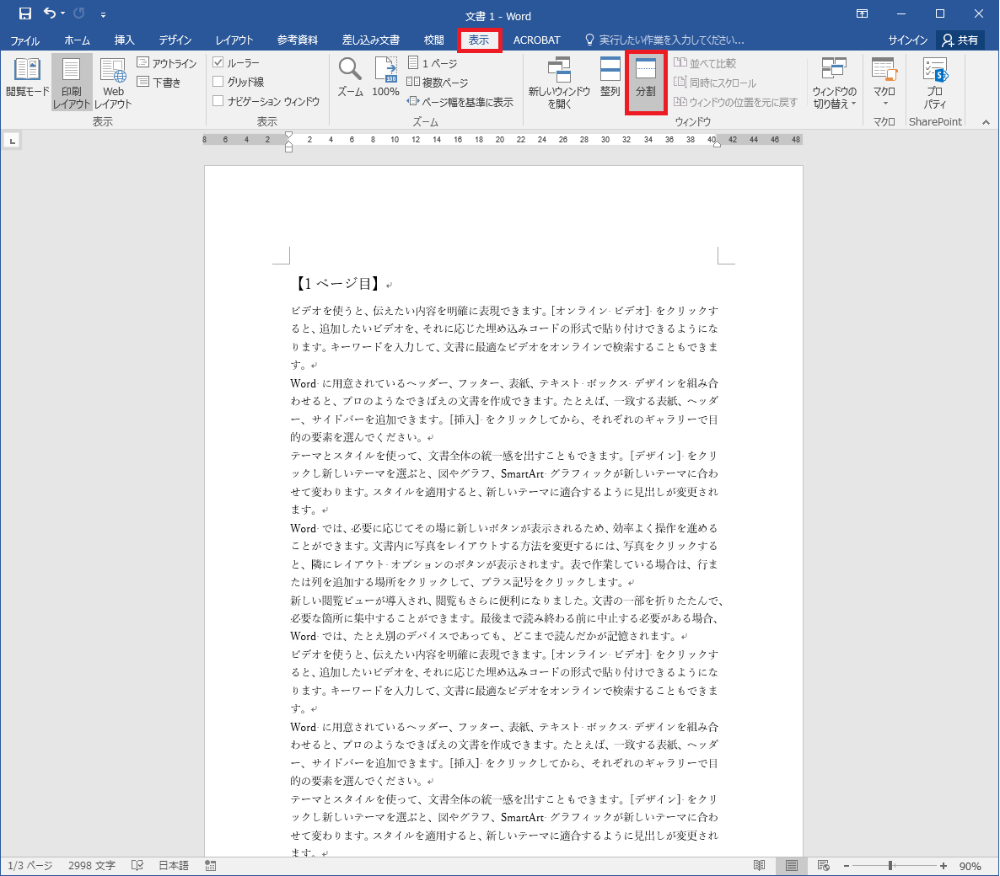
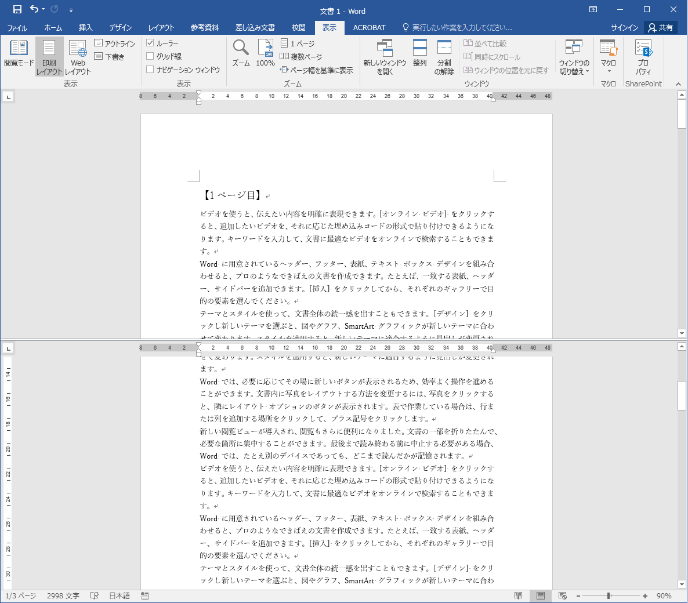
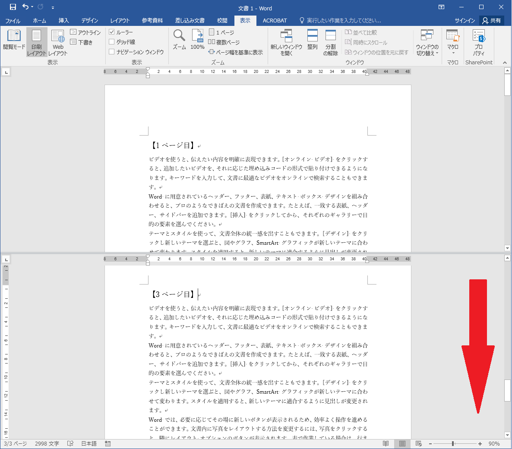
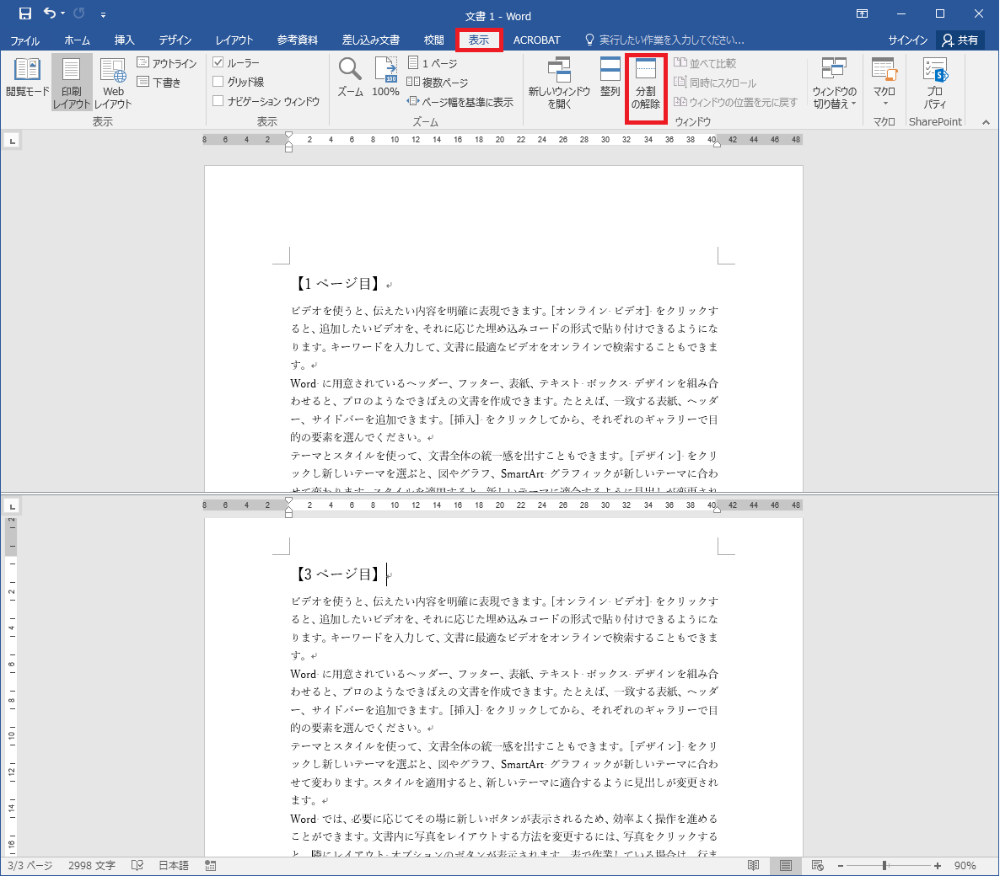
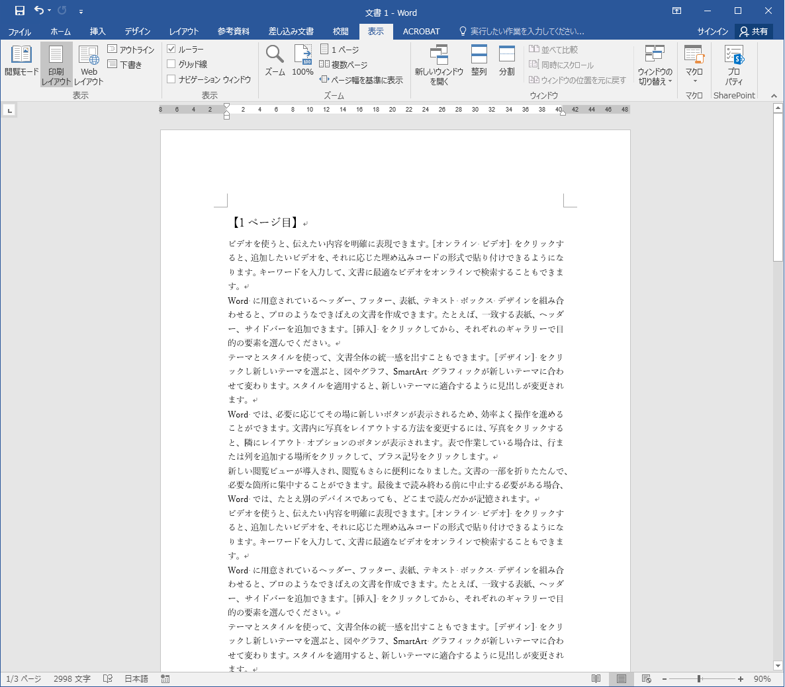

# ウインドウ内で分割して文書を表示

## 概要	
Word では、1つのウィンドウ内を分割し、同じ文書の異なる箇所を表示させることができます。

## 使用方法	
使い方を事例とともに説明します。

### 事例
この機能は下の図のように、文書の1ページ目を参照しながら同じ文書の別ページを修正したい場合などに使用すると便利です。

## 操作方法	

1.文書を分割します。

[表示]タブを選択し、[ウインドウ]メニューの[分割]をクリックします。

2.図のように文書が分割されます。

3.分割された下の文書をスクロールすることで、上では1ページ目を参照しながら3ページ目の文書を編集することができます。

3.分割を解除するときは [表示]タブを選択し、[ウインドウ]メニューの[分割の解除]をクリックします。

4.分割が解除されます。

## 対応バージョン
Word2013で動作確認済みです。
