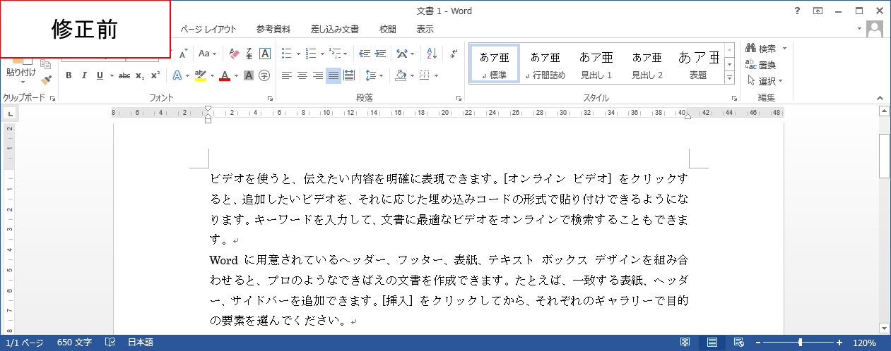
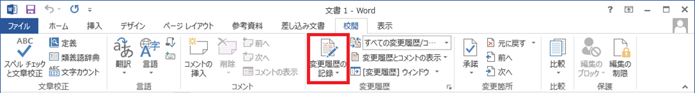

# 変更履歴機能 	

## 概要	
変更履歴機能を使うと、誰がどのようにWord文書を変更したのかが一目でわかります。
文書のレビュー指摘反映箇所などを示すのに役立ちます。

## 使用方法	
使い方を事例とともに説明します。

### 事例
文書を修正して他の人に見せる時、例えば以下の画像のような変更箇所を示すにはどうすればよいでしょうか。

言葉で説明するなら、
   * ～ページ目の2段落目の「できばえ」を「出来栄え」に修正

といった具合の説明になると思います。 しかし、変更箇所が多かったり、複数人で修正していたりすると、言葉で説明するのは困難ですし時間もかかります。

「変更履歴機能」を使うと、変更箇所が視覚的に把握できるため、差分がわかりやすくなります。

### 操作方法
それでは、変更履歴機能の使い方を見てみましょう。

1. 記録の開始  
[校閲]タブの[変更履歴]ボタンを押すと、変更履歴の記録が開始します。 
これにより、変更を加えた箇所が履歴として表示されるようになります。

1. 文書の修正  
文書を修正すると、追加した文と削除した文が以下のように表示されます。 このように、元の文をどう変更したのかが一目でわかります。

1. 変更の承諾  
修正が終わり、変更に問題がなければ、[承諾]ボタンを押し、変更を確定します。

1. 記録の終了  
[校閲]タブの[変更履歴]ボタンを再度押すと、変更履歴の記録が終了します。

## 対応バージョン
Word2013で動作確認済みです。
