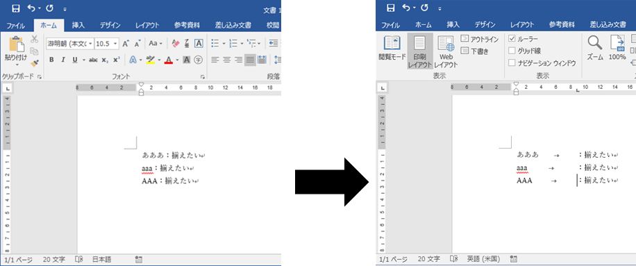
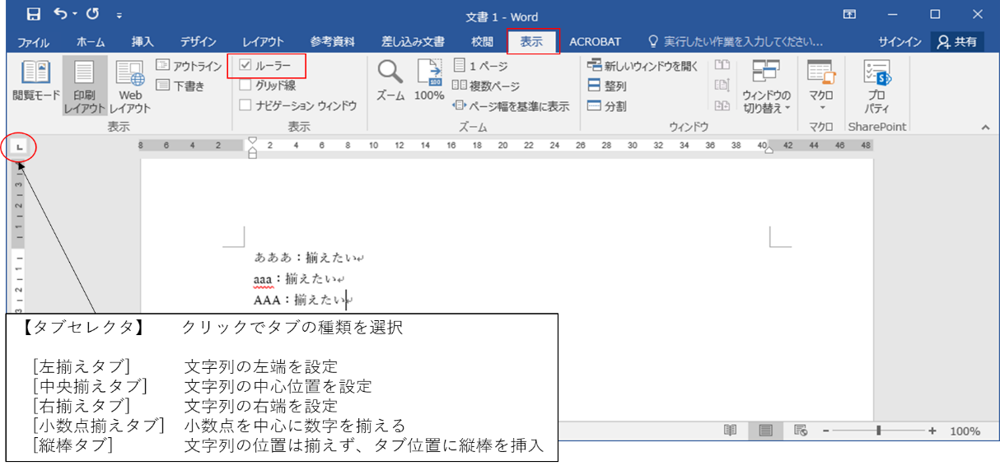
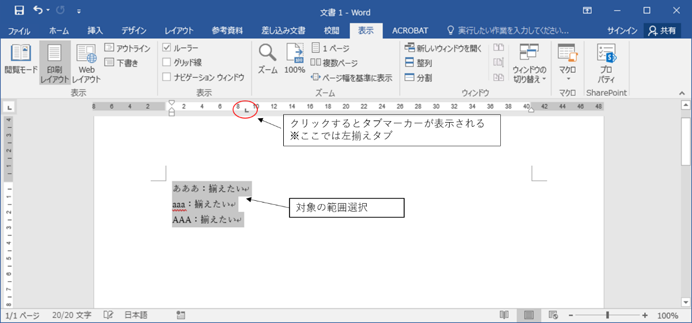
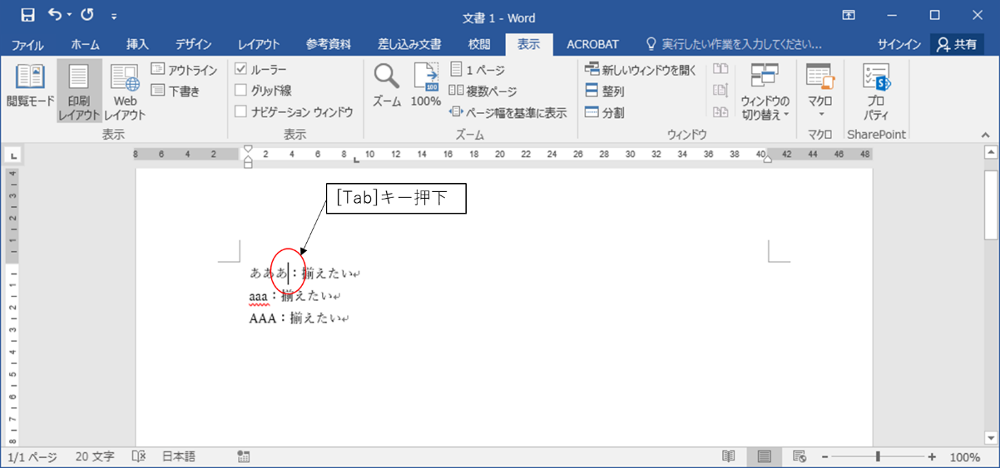
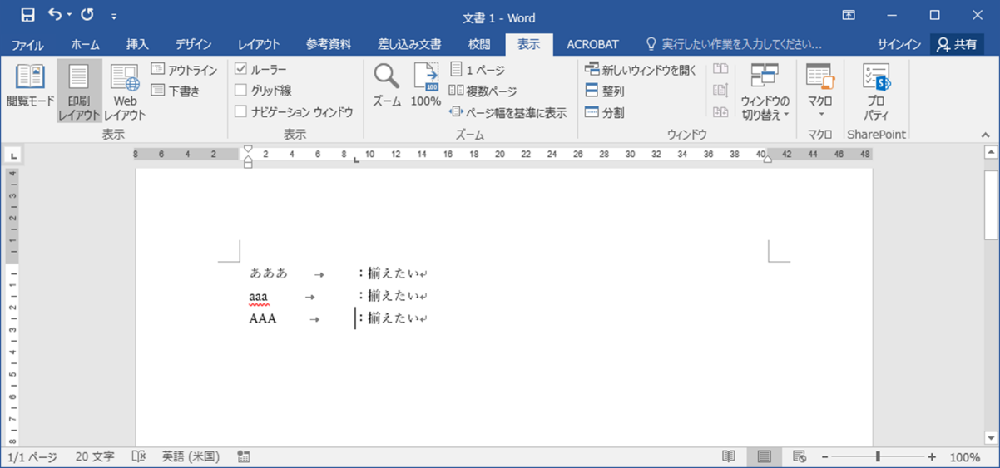

# 好きな位置で文字列を揃える 	

## 概要	
Word には、あらかじめ設定した文字間隔の位置に文字列を移動させる「タブ」という機能があります。
水平ルーラー上でタブ位置を指定してキーボードの [Tab]キーを押すと、好きな位置で文書を整えることができます。

## 使用方法	
使い方を事例とともに説明します。

### 事例
下の図のように各行の「：揃えたい」の開始位置を、スペースを使うことなくきれいに揃えたいときに

この機能を使用します。

### 操作方法	
それでは、操作方法を見てみましょう。

1.[表示]タブの[ルーラー]のチェックボックスにチェックを入れます。

[タブセレクタ]でタブの種類を[左揃えタブ]にします。

※[タブセレクタ]をクリックすることでタブの種類を変更できます。

2.文字列を揃える対象の範囲を選択し、「：揃えたい」の先頭にしたい位置を決め

水平ルーラー上の目盛りをクリックします。クリックした位置に、タブ マーカーが表示されます。  

3.「：揃えたい」の前にカーソルを合わせ、[Tab]キーを押下します。 

4.他の行も同様にタブを挿入すると、以下の図のように「：揃えたい」の開始位置が揃います。

## 対応バージョン
Word2013で動作確認済みです。

