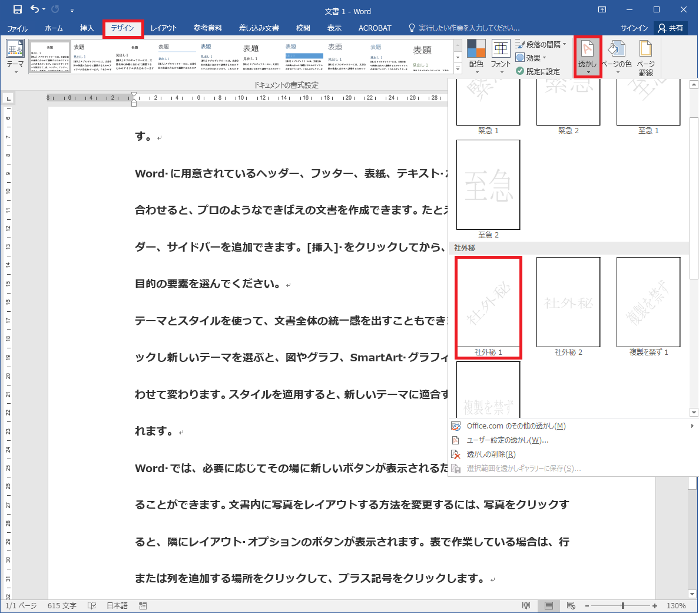
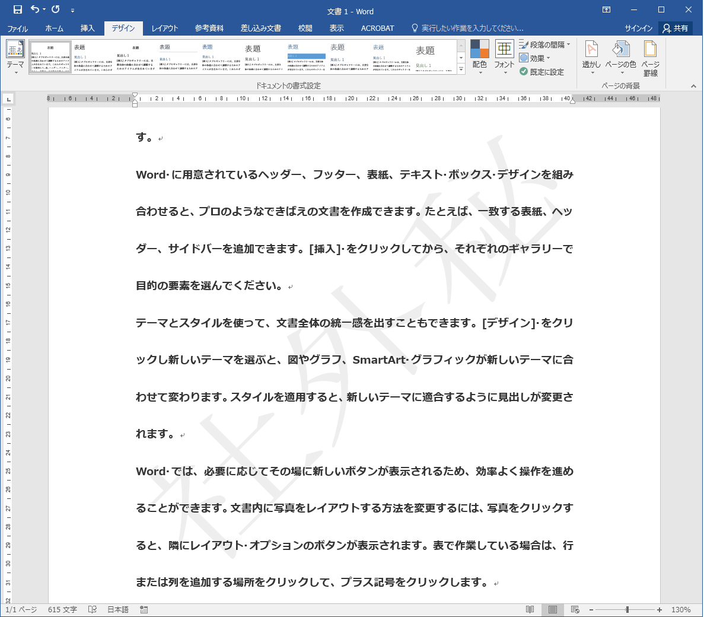
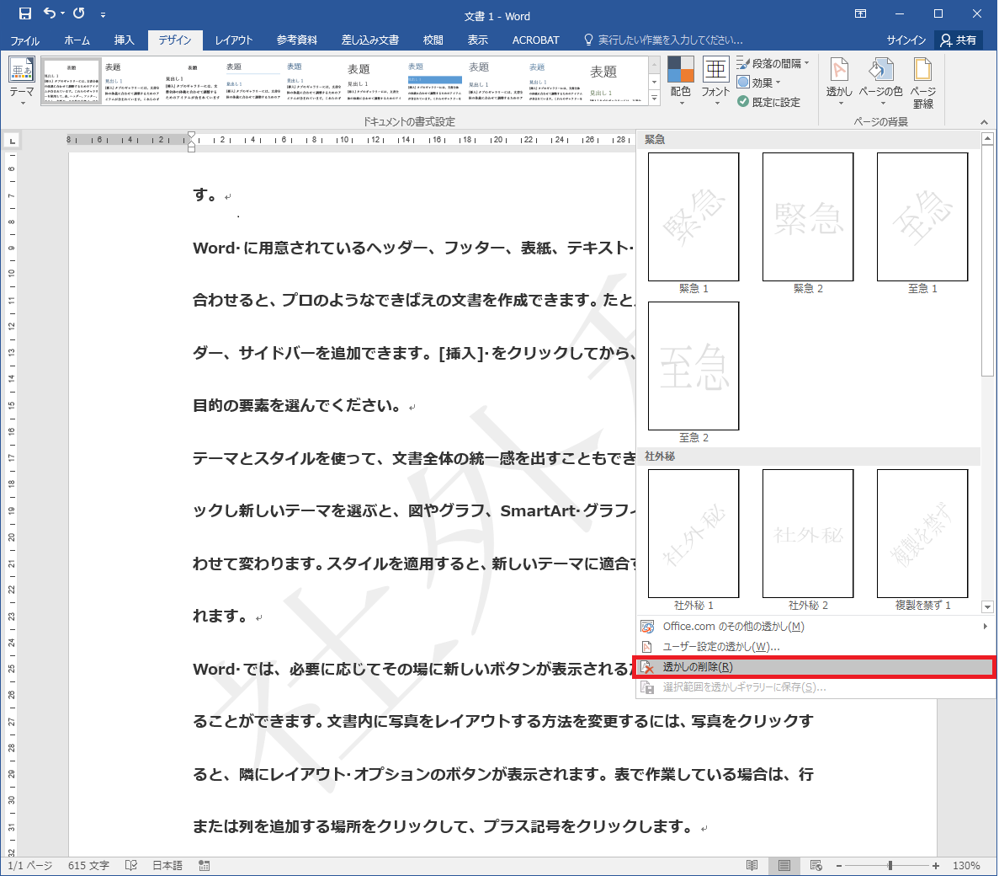
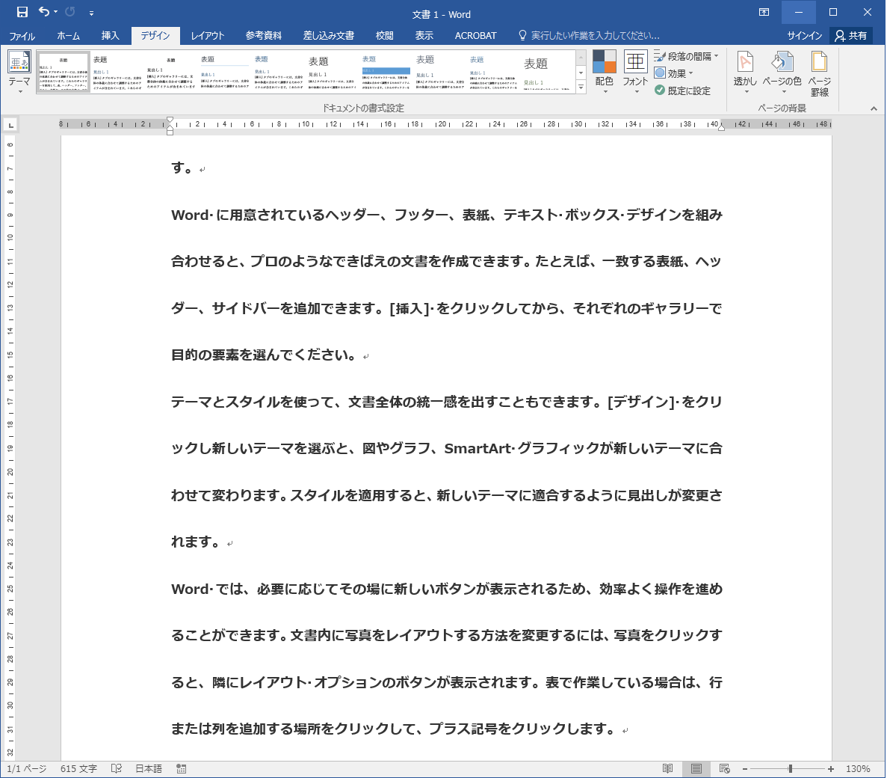

# 透かし文字を設定する

## 概要	
Word では、ページの背景に「至急」「社外秘」などの透かし文字を設定することができます。

## 使用方法	

1.ここでは、「社外秘」の透かし文字を設定します。

[デザイン]タブの[透かし]ボタンをクリックし、サンプルが表示されるので

「社外秘1」を選択します。

2.図のように「社外秘」の透かし文字が設定されます。

3.透かし文字を削除する場合は[デザイン]タブの[透かし]ボタンをクリックし、

[透かしの削除]を選択します。

4.透かし文字が削除されます。

## 対応バージョン
Word2013で動作確認済みです。
