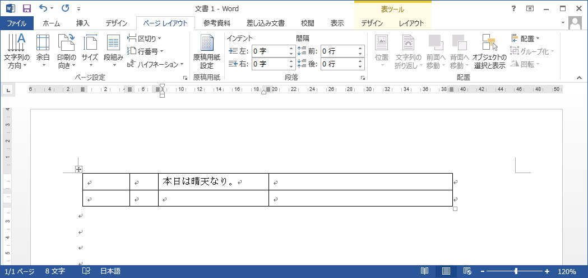

# 選択した文字列をワンクリックで移動する	

## 概要

選択した文字列をワンクリックで移動することができます。

## 使用方法
選択した範囲を以下のように移動したいと思います。 
切り取り＆ペーストでも済みますが、もっと簡単な方法があります。 

移動先にマウスカーソルを当てて、「Ctrl + 右クリック」してください。 

一瞬で移動することができました。 

## 対応バージョン
Word2013で動作確認済みです。
