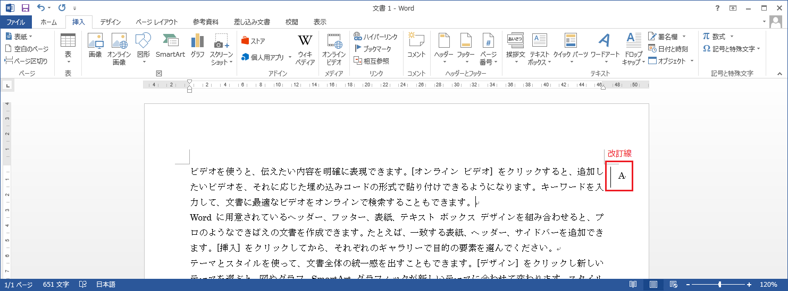
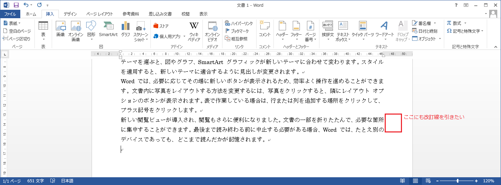
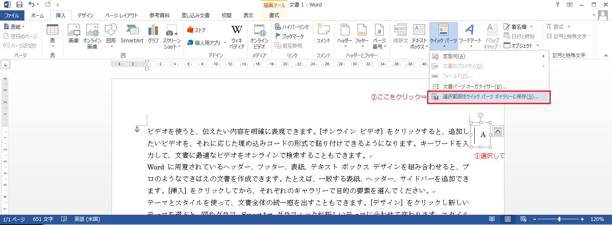
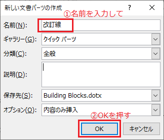
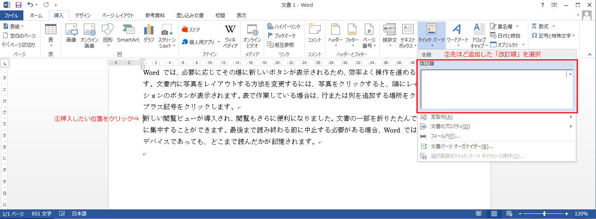
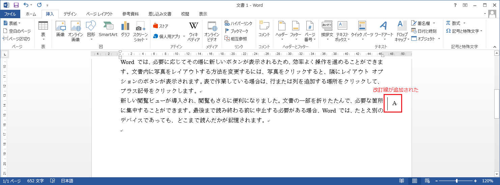

# 頻繁に使用するパーツの登録(クイックパーツ)	

## 概要	
クイックパーツを使うと、よく使う図形や文言を文書に簡単に挿入することができます。

## 使用方法
事例とともに使い方を見てみましょう。

### 事例
ある文書に改訂線(A)が引いてあります。 

この改訂線を別の場所にも引きたいと思います。 

図形をコピー＆ペーストしても良いですが、別の文書に挿入したい場合は、コピー元とコピー先の両方の文書を開く必要があり、少し手間です。

そこで、「クイックパーツ」の出番です。
頻繁に使用する図形や文言をクイックパーツとして登録すると、いつでもすぐに利用することができます。

### クイックパーツを登録する
1. クイックパーツとして使用したい図形(ここでは改訂線)を選択し、[挿入]タブの[クイックパーツ]ボタンより[選択範囲をクイックパーツギャラリーに保存]をクリックします。 

2. [新しい文書パーツの作成]ダイアログが表示されるので、パーツの名前(ここでは「改訂線」)を入力し、[OK]ボタンを押します。これで、クイックパーツを使用する準備が整いました。 

3. 次に、クイックパーツを挿入したい場所をクリックし、[挿入]タブの[クイックパーツ]ボタンより、先ほど登録した「改訂線」をクリックします。 

4. すると、先ほど登録した「改訂線」を挿入することができました。 

## 対応バージョン
Word2013で動作確認済みです。
