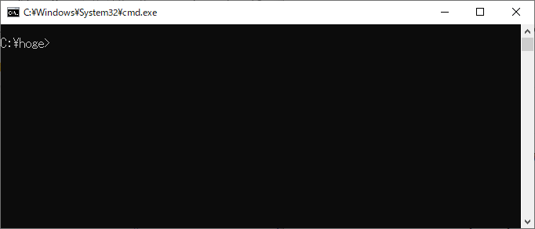
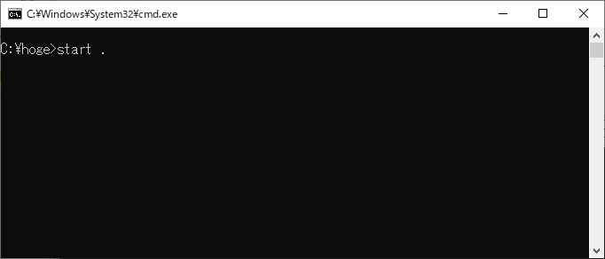
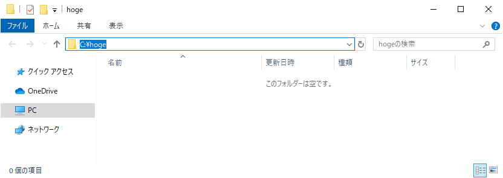

# カレントディレクトリをエクスプローラーで表示する	

## 概要
コマンドプロンプト上のカレントディレクトリをエクスプローラーで表示することができます。

## 操作方法	

1. コマンドプロンプトのカレントディレクトリが"C:\\hoge"であるとして、このディレクトリををエクスプローラーで表示してみたいと思います。 

2. コマンド"start ."を打ち込み、Enterキーを押します。 

3. エクスプローラーが起動しました。カレントディレクトリは"C:\\hoge"となっています。 

## 対応バージョン
バージョン10.0で動作確認済みです。
