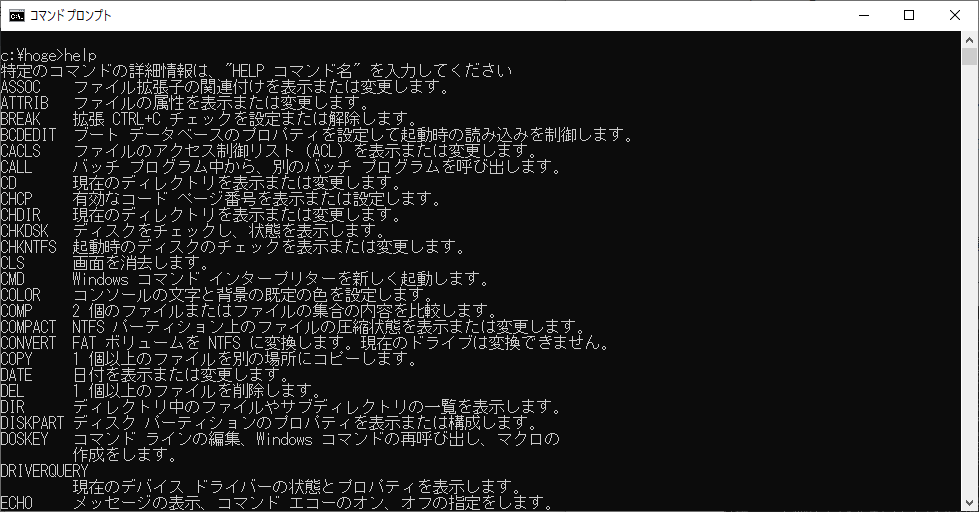
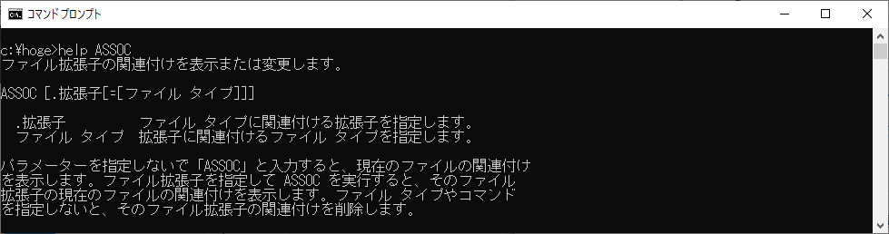

# コマンド一覧の表示	

## 概要
コマンドプロンプトで使用可能なコマンドの一覧を表示します。

[オンラインドキュメント](https://docs.microsoft.com/ja-jp/windows-server/administration/windows-commands/windows-commands)も参考になります。

## 操作方法	

1. "help"と入力すると、コマンドの一覧が表示されます。

2. コマンドの詳細を知りたい時は、"help <コマンド名>"を入力すると、詳細が表示されます。

## 対応バージョン
バージョン10.0で動作確認済みです。
