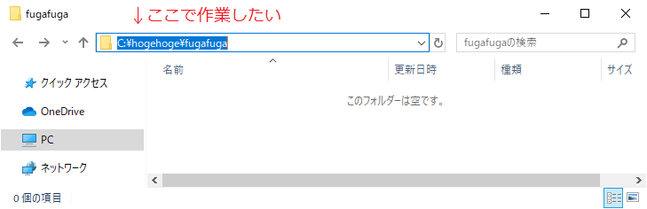
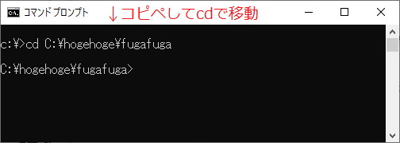
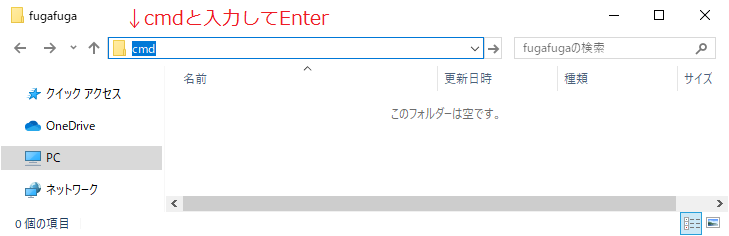
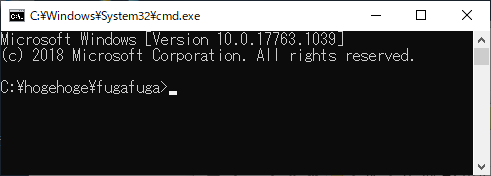

# 作業中のフォルダでコマンドプロンプトを開く	

## 概要
エクスプローラーで開いているフォルダ上からコマンドプロンプトを起動すると、そのフォルダをカレントディレクトリとして起動することができます。

## 事例
エクスプローラーで開いているフォルダをカレントディレクトリとして作業したいときは、普通は以下の方法をとることになると思います。

1. エクスプローラーのアドレスバーからパスをコピー 

1. コマンドプロンプトにパスをペーストしてcdコマンドで移動 

これをもっと簡単に行う方法があります。

## 操作方法	
1. エクスプローラーのアドレスバーに"cmd"と打ち込み、Enterキーを押しましょう。 

1. コマンドプロンプトが起動しました。 カレントディレクトリはエクスプローラーで表示していたフォルダとなっています。 

## 対応バージョン
バージョン10.0で動作確認済みです。
